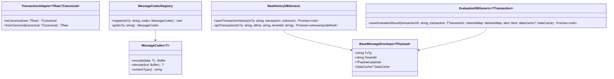
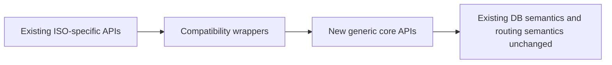

# Type-Agnostic Message Evolution Plan for `frms-coe-lib`

## Executive Summary

This document defines a concrete, low-risk evolution path to make `frms-coe-lib` accept first-class custom message types while preserving existing behavior for current ISO message families (`pacs.002.001.12`, `pacs.008.001.10`, `pain.001.001.11`, `pain.013.001.09`).

The core approach is:

1. Introduce a **generic base transaction contract** and generic request/report/db interfaces.
2. Keep current APIs as **backward-compatible aliases/wrappers**.
3. Add one **generic raw-history API** and one **generic evaluation API**, while retaining existing methods untouched for compatibility.
4. Make Redis/protobuf message handling support a **pluggable codec registry** (default codec preserves current FRMS protobuf behavior).
5. Preserve all existing semantics (DB conflict keys, route logic, condition models, processor config behavior), changing only typing surfaces and serialization extensibility points where required.

This allows existing consumers to continue working unchanged, while new consumers can register and use custom message types with full TypeScript support.

---

## 1. Goals and Non-Goals

### Goals

- Allow application-defined transaction payloads to be type-safe through library APIs.
- Preserve existing runtime behavior for built-in message types.
- Minimize API breaking changes through additive design.
- Keep the existing FRMS domain intent: message-type routing via `txTp`, event history storage, evaluation storage, and redis cache integration.

### Non-Goals

- Rewriting FRMS domain models (conditions, network maps, logger, apm, env config).
- Replacing PostgreSQL or Redis architecture.
- Removing current ISO-specific interfaces in this phase.

---

## 2. Current Constraints (Why change is required)

The library currently hard-codes message families in critical APIs:

- `RawHistoryDB` stores four concrete message interfaces only.
- `EvaluationDB`, `RuleRequest`, `TADPRequest`, `CMSRequest`, and `TADPReport` are bound to `Pacs002`.
- Redis set/object binary paths assume `FRMSMessage` protobuf.
- `Full.proto` enumerates only known message families and lacks a generic extension payload.

These constraints prevent first-class custom message typing even though `TxTp` is already modeled as a string and network map routing is message-type-keyed.

---

## 3. Target Architecture (Type-Agnostic Core + Legacy Compatibility)



### Compatibility principle

Existing built-in models become **specializations** of the generic contract, not replaced.



---

## 4. Concrete Change Set (File-by-file)

## 4.1 New generic interfaces (additive)

### Add: `src/interfaces/message/BaseMessage.ts`

Define core generic contracts:

- `BaseMessageEnvelope<TPayload = unknown>`
- `BuiltInTxType = 'pacs.002.001.12' | 'pacs.008.001.10' | 'pain.001.001.11' | 'pain.013.001.09'`
- `TransactionLike<TPayload = unknown> = { TxTp: string; TenantId: string } & TPayload`

Justification:
- Needed to represent custom payloads without losing `TxTp`/`TenantId`, which are foundational for current persistence/routing semantics.

### Add: `src/interfaces/message/MessageCodec.ts`

Define pluggable serialization:

- `MessageCodec<T>` (`encode`, `decode`, `contentType`)
- `MessageCodecRegistry` interface

Justification:
- Current FRMS protobuf codec is hardcoded; this introduces extension without changing default behavior.

### Update: `src/interfaces/index.ts`

Export new message interfaces.

Justification:
- Public typing surface must expose generic contracts.

---

## 4.2 Generic DB interfaces (additive + aliasing)

### Update: `src/interfaces/database/RawHistoryDB.ts`

Add generic methods while preserving existing methods:

- `saveTransactionHistory<TTransaction>(txTp: string, transaction: TTransaction): Promise<void>`
- `getTransaction<TTransaction>(txTp: string, id: string, tenantId: string): Promise<TTransaction | undefined>`

Keep existing methods:

- `saveTransactionHistoryPain001`, `saveTransactionHistoryPain013`, `saveTransactionHistoryPacs008`, `saveTransactionHistoryPacs002`, `getTransactionPacs008`

Justification:
- Existing users must not break.
- Generic path is required for custom type support.

### Update: `src/interfaces/database/EvaluationDB.ts`

Make generic transaction type parameterized:

- `export interface EvaluationDB<TTransaction = Pacs002> { ... }`
- `saveEvaluationResult(..., transaction: TTransaction, ...)`

Justification:
- Existing default remains `Pacs002`; custom consumers can opt-in by binding `TTransaction`.

### Update: `src/interfaces/processor-files/TADPReport.ts`

- `Evaluation<TTransaction = Pacs002>` with `transaction: TTransaction`

### Update: `src/interfaces/processor-files/TADPRequest.ts`

- `TADPRequest<TTransaction = Pacs002>` with `transaction: TTransaction`

### Update: `src/interfaces/processor-files/CMSRequest.ts`

- `CMSRequest<TTransaction = Pacs002>` with `transaction: TTransaction`

### Update: `src/interfaces/rule/RuleRequest.ts`

- `RuleRequest<TTransaction = Pacs002>` with `transaction: TTransaction`

Justification for all above:
- These are currently the main compile-time blockers for custom message types.
- Default generic parameter preserves current API shape and existing downstream behavior.

---

## 4.3 Builder implementations

### Update: `src/builders/rawHistoryBuilder.ts`

Implement generic methods and keep current wrappers:

- `saveTransactionHistory(txTp, transaction)` dispatches to storage strategy by `txTp`.
- `getTransaction(txTp, id, tenantId)` generic retrieval.
- Existing methods call the generic method internally.

Storage strategy options:

1. **Preferred (minimal schema drift)**: add a generic table (e.g., `raw_transaction`) with columns:
   - `txTp`, `tenantId`, `endToEndId` (or messageId), `document` jsonb, `createdAt`
2. **No-schema-immediate**: txTp-to-table map config, still allows custom tx types if table exists.

Justification:
- Necessary to support unknown tx types without adding one method/table per type.
- Existing methods remain exact, so current processors continue unchanged.

### Update: `src/builders/evaluationBuilder.ts`

- Make function generic: `evaluationBuilder<TTransaction>(manager: EvaluationDB<TTransaction>, ...)`
- Persist generic `Evaluation<TTransaction>` payload unchanged.

Justification:
- Evaluation data path currently enforces `Pacs002`; this is a direct blocker.

---

## 4.4 Database manager typing glue

### Update: `src/services/dbManager.ts`

- Extend manager type composition to preserve generic DB interfaces while defaulting to current behavior.
- Ensure `CreateDatabaseManager` return type remains backward compatible when generics not specified.

Recommended pattern:

- Add optional generic parameter with default:
  - `CreateDatabaseManager<TConfig extends ManagerConfig, TTransaction = Pacs002>(config: TConfig): Promise<DatabaseManagerInstance<TConfig, TTransaction>>`

Justification:
- This is where all composed interfaces meet; generics must propagate from DB interfaces to consumer-facing manager type.
- Default prevents breakage.

---

## 4.5 Redis / protobuf extensibility (while preserving defaults)

### Add: `src/helpers/messageCodecRegistry.ts`

- In-memory registry mapping `txTp` or `contentType` to codec.
- Register default FRMS protobuf codec on startup.

### Update: `src/services/redis.ts`

Add optional codec-aware methods (additive):

- `setMessage<T>(key: string, value: T, txTp: string, expire?: number): Promise<void>`
- `getMessage<T>(key: string, txTp: string): Promise<T | undefined>`
- `setAddMessage<T>(key: string, value: T, txTp: string): Promise<void>`
- `getMemberMessages<T>(key: string, txTp: string): Promise<T[]>`

Keep existing methods exactly:

- `setAdd`, `addOneGetAll`, `addOneGetCount`, `getBuffer` continue to use FRMS protobuf codec.

Justification:
- No existing behavior changes.
- Adds explicit custom-type path with codec choice.

### Optional (Phase 2): `src/helpers/proto/Full.proto`

If custom message families must be represented inside FRMS protobuf itself:

- Add a generic extension envelope field (e.g., `bytes customPayload`, `string customContentType`, `string customTxTp`) OR `google.protobuf.Any`.

Justification:
- Only needed if your ecosystem requires a single protobuf wire format for all message families.
- If JSON/alternate codec is acceptable for custom types, this proto change can be deferred.

---

## 4.6 Export surface and docs

### Update: `src/index.ts`

- Export generic message interfaces and codec types.
- Keep current exports unchanged.

### Update: `README.md`

Add sections:

- “Custom message type support”
- “Using generic DB and request/report interfaces”
- “Codec registry and redis message methods”

Justification:
- Public feature without docs will be misused and create migration friction.

---

## 5. Backward Compatibility Contract

The following must remain behaviorally identical:

- Existing built-in interfaces and names (`Pacs002`, `Pacs008`, `Pain001`, `Pain013`).
- Existing `CreateDatabaseManager` call shape without generics.
- Existing raw history methods and SQL behavior.
- Existing redis methods and FRMS protobuf handling.
- Existing condition/event history/network map semantics.

Compatibility techniques:

- Additive generic methods and interfaces.
- Default generic parameters (`= Pacs002`).
- Wrappers from old methods to generic internals.
- No removal in this phase.

---

## 6. Migration Plan (Phased)

### Phase 0: Foundation (No runtime behavior change)

- Add generic interfaces.
- Add defaulted generics to request/report/evaluation typing.
- Keep all implementations functionally identical.

Exit criteria:

- All existing tests pass unchanged.
- TypeScript compile passes without downstream changes.

### Phase 1: Generic data path enablement

- Implement `saveTransactionHistory/getTransaction` generic methods.
- Implement generic `Evaluation` persistence typing.
- Add codec registry and codec-aware Redis methods.

Exit criteria:

- Existing tests pass.
- New tests show one custom message type persists and reads successfully.

### Phase 2: Optional unified protobuf extension

- Extend `Full.proto` for custom payload envelope if required.
- Maintain default FRMS protobuf decode for existing methods.

Exit criteria:

- Wire-level interoperability validated for built-ins and custom payload path.

---

## 7. Required Test Additions

Add tests without removing existing ones:

1. `__tests__/dbManager.custom-types.test.ts`
   - Saves/retrieves custom transaction via generic raw-history methods.
2. `__tests__/evaluation.custom-types.test.ts`
   - Persists custom transaction in generic evaluation payload.
3. `__tests__/redis.custom-codec.test.ts`
   - Registers custom codec, writes/reads typed message.
4. Type-level tests (or compile fixtures)
   - Ensure defaults still infer `Pacs002` when no generic provided.

Justification:
- Prevent regressions in existing behavior while proving new custom-type capability.

---

## 8. Risks and Mitigations

- **Risk:** Generic API introduces ambiguous ID extraction for raw history retrieval.
  - **Mitigation:** Keep explicit key arguments (`id`, `tenantId`) and configurable key extractor per tx type.

- **Risk:** Codec mismatch between producer and consumer.
  - **Mitigation:** Include `contentType` metadata conventions; registry lookup by `txTp` + content type.

- **Risk:** Generic typing leaks into all consumers immediately.
  - **Mitigation:** Default generic parameters and legacy aliases prevent mandatory migration.

---

## 9. Recommended Interface Shapes (concrete)

```ts
export interface BaseMessageEnvelope<TPayload = unknown> {
  TxTp: string;
  TenantId: string;
  payload: TPayload;
  DataCache?: DataCache;
}

export interface RuleRequest<TTransaction = Pacs002> {
  transaction: TTransaction;
  networkMap: NetworkMap;
  DataCache: DataCache;
  metaData?: MetaData;
}

export interface EvaluationDB<TTransaction = Pacs002> {
  saveEvaluationResult(
    transactionID: string,
    transaction: TTransaction,
    networkMap: NetworkMap,
    alert: Alert,
    dataCache?: DataCache
  ): Promise<void>;
}

export interface RawHistoryDB {
  saveTransactionHistory<TTransaction>(txTp: string, transaction: TTransaction): Promise<void>;
  getTransaction<TTransaction>(txTp: string, id: string, tenantId: string): Promise<TTransaction | undefined>;

  // legacy methods retained
  saveTransactionHistoryPain001(transaction: Pain001): Promise<void>;
  saveTransactionHistoryPain013(transaction: Pain013): Promise<void>;
  saveTransactionHistoryPacs008(transaction: Pacs008): Promise<void>;
  saveTransactionHistoryPacs002(transaction: Pacs002): Promise<void>;
}
```

---

## 10. Concrete Justification Matrix

| Change | Why it is required | Why minimal / preserves spirit |
|---|---|---|
| Add generic transaction interfaces | Enables custom type acceptance at compile-time | Additive only; existing interfaces unchanged |
| Generic raw history methods | Current API cannot store arbitrary tx families | Existing per-type methods retained as wrappers |
| Generic evaluation/request/report typing | Current APIs force `Pacs002` | Default generic keeps current behavior |
| Codec registry + codec-aware redis methods | Current binary set/object methods assume FRMS protobuf | Existing methods unchanged; new path opt-in |
| Optional proto extension | Needed only for unified protobuf wire for custom types | Deferred unless required; avoids unnecessary churn |

---

## 11. Implementation Order (recommended)

1. Add generic interfaces and defaulted generic request/report/evaluation types.
2. Update builders and db manager type composition to propagate generics.
3. Add generic raw-history methods and wrappers.
4. Add codec registry and codec-aware redis APIs.
5. Add tests for custom type support + regression tests for current behavior.
6. Optionally extend protobuf schema if required by deployment architecture.

This order minimizes breakage risk and keeps behavior parity verifiable at each step.

---

## 12. Acceptance Criteria

This evolution is complete when:

- Existing consumers compile and run without changes.
- A new consumer can define `MyCustomTransaction` and pass it through typed library APIs (rule/evaluation/raw-history/redis codec-aware methods).
- Existing built-in type flows produce identical runtime outputs and DB writes as before.
- Tests verify both backward compatibility and custom-type enablement.
