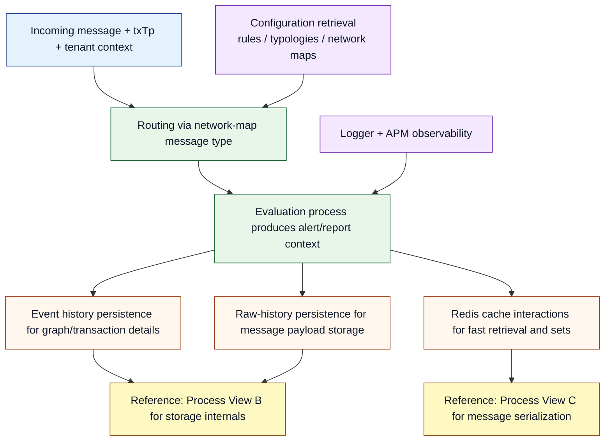
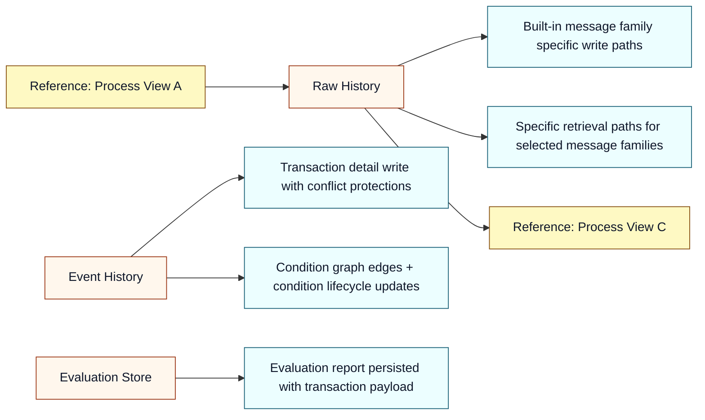
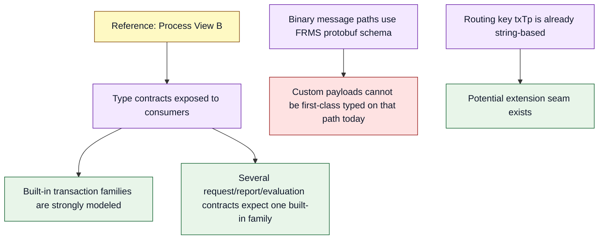
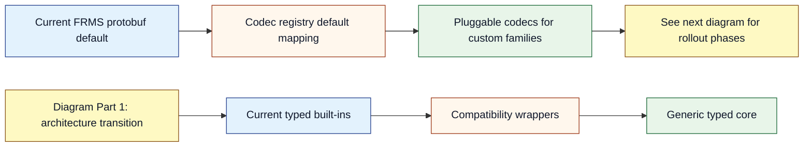
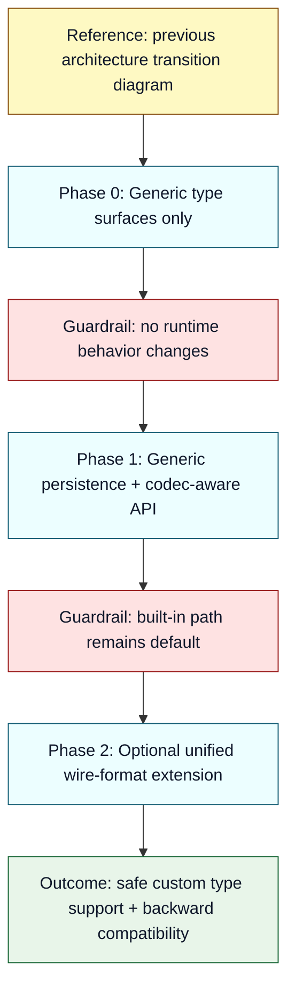

# Type-Agnostic Message Evolution Plan for `frms-coe-lib`

## Summary

This planning document proposes a safe, incremental way to let `frms-coe-lib` support first-class custom message types while preserving existing behavior for today’s built-in ISO flows.

The guiding principle is **extension without disruption**:

- keep current contracts and runtime semantics as the default path,
- add a generic type system and codec extension path as an opt-in,
- preserve strict TypeScript guarantees through constrained generic interfaces and default type parameters,
- roll out in phases with explicit compatibility checkpoints.

Expected outcome:

- existing consumers continue to compile and run unchanged,
- new consumers can bring their own message types safely,
- maintainers keep operational confidence because behavior for current traffic remains stable.

---

## 1. Goals and Non-Goals (Concrete)

### 1.1 Goals

1. **Type-agnostic acceptance:** Enable consumers to use custom transaction payloads without unsafe casts.
2. **Strict typing retained:** Preserve strict TypeScript behavior; no shift to permissive `any`-driven APIs.
3. **Backward compatibility:** Keep current processor and storage behavior intact for built-in message families.
4. **Operational continuity:** Preserve current routing, condition handling, conflict semantics, and cache behavior by default.
5. **Adoption practicality:** Make custom type usage straightforward for consumers (low ceremony, clear extension points).

### 1.2 Non-Goals

1. Re-architecting the broader FRMS domain model.
2. Replacing PostgreSQL, Redis, logging, APM, or configuration subsystems.
3. Forcing immediate migration of existing processors.
4. Removing existing built-in ISO type contracts in this initiative.

### 1.3 Design Guardrails

- Additive changes first; destructive changes deferred.
- Old behavior is the reference baseline and must remain available.
- Every new generic path must have a default compatible behavior.
- New abstractions must map clearly to today’s operational model.

---

## 2. How the Library Works Today (Current Process Understanding)

This section explains the runtime process in practical terms for readers unfamiliar with the codebase.

### 2.1 Process View A — End-to-End Functional Flow

### 2.2 Process View B — Storage Behavior (Current)

### 2.3 Process View C — Serialization and Type Handling (Current)

### 2.4 Current-State Confidence Summary

- The library already has a useful message-type discriminator concept (`txTp`/`TxTp`) at routing level.
- The primary limitation is not routing; it is **hard binding of some contracts and storage paths** to known message shapes.
- Therefore, type-agnostic support is feasible without changing the core system intent.

---

## 3. Detailed Summary: Safe Type-Agnostic Extension Strategy (No Code References)

This section intentionally describes the approach at system/process level for steering review.

### 3.1 Safety Model

The safest strategy is to separate message handling into two layers:

1. **Core envelope contract** (always required): transaction type, tenant identity, and shared metadata.
2. **Payload contract** (generic): message-family-specific structure supplied by producer/consumer.

Why this is safe:

- shared invariants remain strongly typed and mandatory,
- payload variation is controlled through generic parameters, not dynamic untyped objects,
- strict mode still enforces compile-time correctness per consumer-defined type.

### 3.2 Compatibility Model

Use a dual-path model:

- **Legacy path:** existing built-in contracts continue as default.
- **Generic path:** new generic interfaces and methods for custom message families.

This avoids forcing migration while enabling innovation.

### 3.3 TypeScript Strictness Model

To preserve strict TypeScript guarantees:

- use constrained generics with required envelope fields,
- use default generic type parameters so current consumers keep current inference,
- keep serialization interfaces typed (`encode/decode<T>`),
- avoid introducing unconstrained `any` in public contracts.

### 3.4 Consumer Experience Model

Consumer should be able to:

1. define `MyCustomMessage` type,
2. bind library generic interfaces with that type,
3. optionally register a codec for serialization,
4. use custom type in persistence/evaluation paths with compile-time validation.

No deep internal library knowledge should be required for this.

---

## 4. Detailed Investigation of the Proposed Plan (Steering-Committee View)

### 4.1 Is this extension feasible without destabilizing the system?

Yes, for three reasons:

1. **Message-type discrimination already exists** as a core operational concept.
2. **Most subsystem behavior is payload-agnostic** once shared identifiers are available.
3. **Compatibility can be preserved with additive design** rather than replacement.

### 4.2 What architectural pattern best fits this system?

The recommended pattern is **Typed Envelope + Pluggable Codec + Compatibility Wrappers**.

### 4.3 Why not do a hard switch to a fully generic-only API?

Because hard switch introduces unnecessary migration and operational risk:

- all downstream services would need simultaneous adaptation,
- any hidden assumptions in downstream typing could break production pipelines,
- rollback complexity increases sharply.

A phased additive strategy is safer and more governable.

### 4.4 Governance and Reviewability

This plan is suitable for governance because:

- each phase has explicit entry/exit criteria,
- compatibility can be validated by regression tests,
- risk can be isolated and measured before advancing.

---

## 5. Side-Effects Review (Detailed, Non-Code-Heavy)

### 5.1 Positive effects

1. **Faster onboarding of new message families** without repeated library releases for each schema.
2. **Stronger consumer typing** for custom workflows.
3. **Reduced pressure on core maintainers** to hard-code every new payload model.

### 5.2 Neutral/expected changes

1. API surface area increases modestly (generic variants + legacy wrappers).
2. Documentation and onboarding material must expand.
3. Test suite grows to include compatibility + generic-path validation.

### 5.3 Potential negative effects and controls

1. **Complexity increase in public typing model**
   - Control: keep defaults and provide “legacy quick path” docs.
2. **Codec mismatch risk in distributed systems**
   - Control: explicit content-type metadata and deterministic registry policy.
3. **Operational inconsistency if teams mix old/new patterns ad hoc**
   - Control: phased adoption guidance and reference usage patterns.

### 5.4 Impact on reliability and performance

- Reliability impact should be low if wrappers preserve existing semantics.
- Performance impact is expected to be minimal in typed layers; serialization path needs benchmark checks only if additional codec indirection is introduced in hot paths.

### 5.5 Impact on maintainability

- Short term: moderate increase in conceptual surface.
- Medium term: improved maintainability due to reduced need for per-message hardcoding.

---

## 6. Planning Blueprint: Concrete Changes Needed in the Library

This is the implementation planning checklist (not execution).

### 6.1 Public Type System

Planned changes:

1. Introduce generic envelope and transaction-like contracts.
2. Introduce typed codec abstractions.
3. Parameterize request/report/evaluation contracts with safe defaults.

Why required:

- unlocks custom message typing while retaining strict mode.

### 6.2 Persistence Interfaces

Planned changes:

1. Add generic raw-history write/read methods.
2. Keep legacy message-family-specific methods as compatibility wrappers.
3. Make evaluation contract generic with backward-compatible default transaction type.

Why required:

- current hard-typed persistence interfaces block custom-type acceptance.

### 6.3 Manager Composition and Dependency Wiring

Planned changes:

1. Propagate generic transaction parameter through manager composition types.
2. Preserve non-generic invocation behavior and return typing defaults.

Why required:

- ensures custom type can travel end-to-end in typed API surface.

### 6.4 Serialization and Redis Strategy

Planned changes:

1. Add codec registry abstraction.
2. Keep current FRMS protobuf behavior as default codec path.
3. Add explicit codec-aware APIs for custom families.
4. Optionally add unified wire-format extension in protobuf as phase-2 decision.

Why required:

- allows custom payload transport without breaking built-in binary workflows.

### 6.5 Documentation and Developer Experience

Planned changes:

1. Add migration guides for “stay legacy” and “adopt generic” modes.
2. Add canonical usage examples for consumer-defined message types.
3. Add strict typing guidance and troubleshooting notes.

Why required:

- adoption success depends on clarity as much as API design.

### 6.6 Testing and Acceptance Gating

Planned changes:

1. Regression tests to prove unchanged legacy behavior.
2. New tests proving one custom type can flow through generic APIs safely.
3. Type-level checks to prove default inference remains backward-compatible.
4. Optional benchmark checks for codec-aware paths.

Why required:

- necessary for technical steering confidence and controlled rollout.

---

## 7. Proposed Rollout Plan and Decision Gates

### Phase 0 — Type Surface Preparation

- Add generic types and defaults.
- No runtime behavior changes.

Gate:

- all existing tests pass; no consumer migration required.

### Phase 1 — Generic Data Path Enablement

- Add generic persistence and codec-aware APIs.
- Keep legacy methods unchanged and operational.

Gate:

- built-in compatibility tests pass;
- custom-type integration test passes.

### Phase 2 — Optional Unified Wire Format

- Decide whether to extend protobuf for universal custom payload wire representation.

Gate:

- architecture review confirms need;
- interoperability test plan approved.

---

## 8. Final Recommendation

Proceed with the additive, phased plan.

It is the highest-confidence route to achieve type-agnostic extensibility while preserving the system’s current operational spirit: deterministic routing by message type, durable history/evaluation persistence, and stable default runtime behavior for existing deployments.
