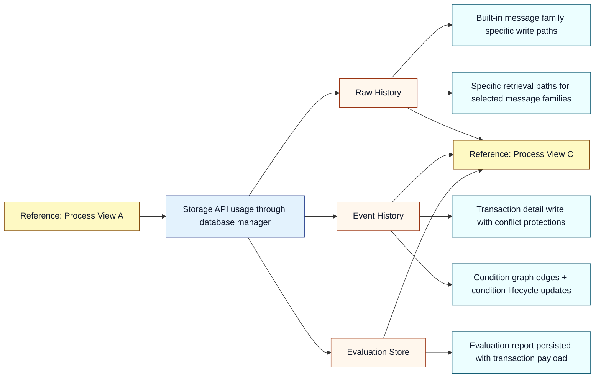
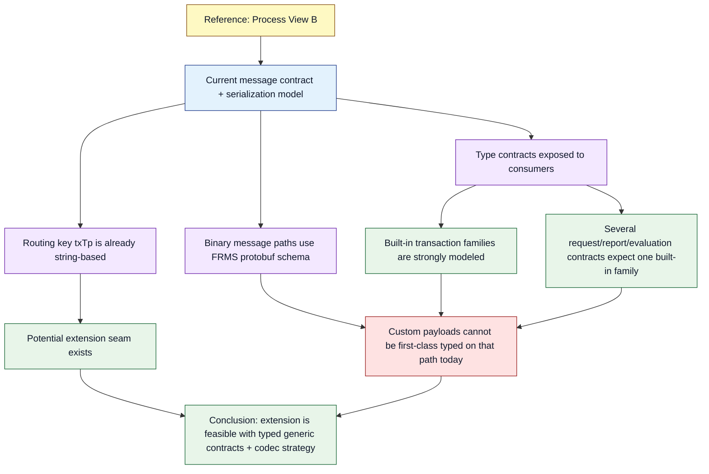
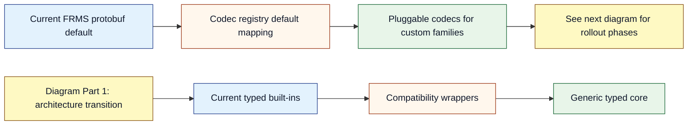
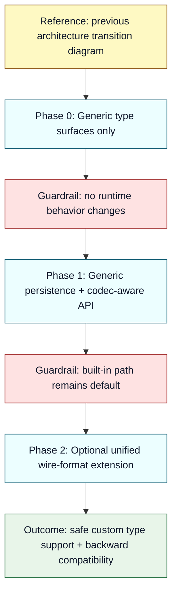

# Type-Agnostic Message Evolution Plan for `frms-coe-lib`

## Summary

This planning document proposes a safe, incremental way to let `frms-coe-lib` support first-class custom message types while preserving existing behavior for today’s built-in ISO flows.

The guiding principle is **extension without disruption**:

- keep current contracts and runtime semantics as the default path,
- add a generic type system and codec extension path as an opt-in,
- preserve strict TypeScript guarantees through constrained generic interfaces and default type parameters,
- roll out in phases with explicit compatibility checkpoints.

Expected outcome:

- existing consumers continue to compile and run unchanged,
- new consumers can bring their own message types safely,
- maintainers keep operational confidence because behavior for current traffic remains stable.

---

## 1. Goals and Non-Goals (Concrete)

### 1.1 Goals

1. **Type-agnostic acceptance:** Enable consumers to use custom transaction payloads without unsafe casts.
2. **Strict typing retained:** Preserve strict TypeScript behavior; no shift to permissive `any`-driven APIs.
3. **Backward compatibility:** Keep current processor and storage behavior intact for built-in message families.
4. **Operational continuity:** Preserve current routing, condition handling, conflict semantics, and cache behavior by default.
5. **Adoption practicality:** Make custom type usage straightforward for consumers (low ceremony, clear extension points).

### 1.2 Non-Goals

1. Re-architecting the broader FRMS domain model.
2. Replacing PostgreSQL, Redis, logging, APM, or configuration subsystems.
3. Forcing immediate migration of existing processors.
4. Removing existing built-in ISO type contracts in this initiative.

### 1.3 Design Guardrails

- Additive changes first; destructive changes deferred.
- Old behavior is the reference baseline and must remain available.
- Every new generic path must have a default compatible behavior.
- New abstractions must map clearly to today’s operational model.

---

## 2. How the Library Works Today (Current Process Understanding)

This section explains how the library is used in practice.

Important scope note:

- `frms-coe-lib` is primarily a **shared library of interfaces, builders, and services**. [REF-01] [REF-03]
- It does **not** implement one monolithic end-to-end transaction processor by itself. [REF-03]
- The flows below therefore describe a **typical consumer-application pipeline that uses this library’s capabilities**. [REF-01] [REF-03]

### 2.1 Process View A — End-to-End Functional Flow

```mermaid
flowchart TB
  %% Accessible palette and text contrast
  classDef input fill:#E3F2FD,stroke:#1E3A8A,color:#0F172A,stroke-width:1px;
  classDef core fill:#E8F5E9,stroke:#166534,color:#0F172A,stroke-width:1px;
  classDef persist fill:#FFF7ED,stroke:#9A3412,color:#0F172A,stroke-width:1px;
  classDef support fill:#F3E8FF,stroke:#6B21A8,color:#0F172A,stroke-width:1px;
  classDef note fill:#FEF9C3,stroke:#854D0E,color:#0F172A,stroke-width:1px;

  IN[Incoming message + txTp + tenant context]:::input --> APP[Consumer service logic]:::core
  APP --> RT[Consumer uses network-map metadata (including txTp) for routing decisions]:::core
  APP --> EV[Consumer performs rule/evaluation workflow]:::core
  APP --> EH[Consumer calls event-history persistence APIs]:::persist
  APP --> RH[Consumer calls raw-history persistence APIs]:::persist
  APP --> RC[Consumer uses redis APIs for cache/set operations]:::persist

  CFG[Library configuration APIs<br/>rules / typologies / network maps]:::support --> APP
  LOG[Library logger + APM utilities]:::support --> APP

  N1[Reference: Process View B for storage internals]:::note
  N2[Reference: Process View C for message serialization]:::note
  EH --> N1
  RH --> N1
  RC --> N2
```

### 2.2 Process View B — Storage Behavior (Current)



How to read this view:

- `Storage API usage through database manager` is the hub node that ties storage concerns to library-provided persistence methods.
- `Raw History`, `Event History`, and `Evaluation Store` are parallel persistence targets, not independent pipelines.
- Each branch is now explicitly connected forward to Process View C to show continuity in the document narrative.

Fact-check note:

- `Raw History` branch is grounded in current message-family-specific persistence API and implementation. [REF-07] [REF-08]
- `Event History` branch is grounded in transaction detail and condition graph lifecycle APIs. [REF-09] [REF-10]
- `Evaluation Store` branch is grounded in current evaluation persistence and retrieval APIs. [REF-11] [REF-12]

### 2.3 Process View C — Serialization and Type Handling (Current)



How to read this view:

- `Current message contract + serialization model` is the single entry node for this analysis.
- The diagram separates two truths that coexist today: strong built-in typing (`ST` branch) and an extension seam (`S2` branch).
- Both branches converge on one explicit conclusion node, making the reasoning chain complete and non-ambiguous.

Fact-check note:

- Built-in typing branch is grounded in exported built-in message interfaces and request/report contracts. [REF-02] [REF-16] [REF-17] [REF-18] [REF-19]
- Binary schema branch is grounded in FRMS protobuf usage in helpers and Redis binary paths. [REF-13] [REF-14] [REF-15]
- Routing seam branch is grounded in `txTp`/`TxTp` presence in core message and network map interfaces. [REF-05] [REF-20]

### 2.4 Current-State Confidence Summary

- Network-map message entries include `txTp`, and transaction interfaces include `TxTp` as string fields.
- The primary limitation is **type binding in selected interfaces and persistence APIs**, not absence of a message-type concept.
- Binary object/set serialization paths in Redis currently rely on the FRMS protobuf schema.
- Therefore, type-agnostic support is feasible if generic typing and codec extension points are added while preserving legacy defaults.

Fact-check references: [REF-05] [REF-20] [REF-07] [REF-08] [REF-11] [REF-12] [REF-13] [REF-14] [REF-15]

---

## 3. Detailed Summary: Safe Type-Agnostic Extension Strategy (No Code References)

This section intentionally describes the approach at system/process level for steering review.

### 3.1 Safety Model

The safest strategy is to separate message handling into two layers:

1. **Core envelope contract** (always required): transaction type, tenant identity, and shared metadata.
2. **Payload contract** (generic): message-family-specific structure supplied by producer/consumer.

Why this is safe:

- shared invariants remain strongly typed and mandatory,
- payload variation is controlled through generic parameters, not dynamic untyped objects,
- strict mode still enforces compile-time correctness per consumer-defined type.

Fact-check result:

- The strict-mode baseline in this repository is verified (`strict: true`, `noImplicitAny: true`). [REF-21]
- The two-layer model itself is a **proposed architecture decision** (not an existing implementation), selected to satisfy strict typing and compatibility constraints in current APIs. [ADR-01] [ADR-03]

### 3.2 Compatibility Model

Use a dual-path model:

- **Legacy path:** existing built-in contracts continue as default.
- **Generic path:** new generic interfaces and methods for custom message families.

This avoids forcing migration while enabling innovation.

Fact-check result:

- Current API surface is message-family-specific in multiple places; therefore dual-path compatibility is required to avoid breaking consumers. [REF-07] [REF-11] [REF-16] [REF-17] [REF-18] [REF-19]
- The dual-path approach is a proposed decision with compatibility-first intent. [ADR-02]

### 3.3 TypeScript Strictness Model

To preserve strict TypeScript guarantees:

- use constrained generics with required envelope fields,
- use default generic type parameters so current consumers keep current inference,
- keep serialization interfaces typed (`encode/decode<T>`),
- avoid introducing unconstrained `any` in public contracts.

Fact-check result:

- Strict compiler settings are present today, so this design constraint is aligned with repository policy. [REF-21]
- Default generic parameters are proposed to preserve existing call-site inference behavior where concrete types are currently fixed. [ADR-03]

### 3.4 Consumer Experience Model

Consumer should be able to:

1. define `MyCustomMessage` type,
2. bind library generic interfaces with that type,
3. optionally register a codec for serialization,
4. use custom type in persistence/evaluation paths with compile-time validation.

No deep internal library knowledge should be required for this.

Fact-check result:

- Current consumer-facing contracts include multiple Pacs002-bound interfaces and message-family-specific persistence methods, which supports the need for a simpler generic path. [REF-07] [REF-11] [REF-16] [REF-17] [REF-18] [REF-19]
- The simplified consumer experience is a proposed outcome and requires the ADR decisions in Section 4/9. [ADR-01] [ADR-02] [ADR-04] [ADR-05] [ADR-06]

---

## 4. Detailed Investigation of the Proposed Plan (Steering-Committee View)

### 4.1 Is this extension feasible without destabilizing the system?

Yes, for three reasons:

1. **Message-type discrimination already exists** as a core operational concept.
2. **Several storage and utility behaviors are payload-document-oriented**, while a subset of public contracts remain fixed to built-in types.
3. **Compatibility can be preserved with additive design** rather than replacement.

Fact-check references: [REF-05] [REF-20] [REF-07] [REF-08] [REF-11] [REF-12] [REF-13] [REF-14] [REF-15]

### 4.2 What architectural pattern best fits this system?

The recommended pattern is **Typed Envelope + Pluggable Codec + Compatibility Wrappers**.

Decision references: [ADR-01] [ADR-02] [ADR-06] [ADR-07]





### 4.3 Why not do a hard switch to a fully generic-only API?

Because hard switch introduces unnecessary migration and operational risk:

- all downstream services would need simultaneous adaptation,
- any hidden assumptions in downstream typing could break production pipelines,
- rollback complexity increases sharply.

A phased additive strategy is safer and more governable.

Decision references: [ADR-08] [ADR-09]

### 4.4 Governance and Reviewability

This plan is suitable for governance because:

- each phase has explicit entry/exit criteria,
- compatibility can be validated by regression tests,
- risk can be isolated and measured before advancing.

Decision references: [ADR-08]

---

## 4.5 Fact-Check Evidence Map (Current Library)

The following statements in this document are grounded in the current repository implementation.

1. **Built-in transaction families are explicitly modeled in exported interfaces**

  - Evidence: interface exports include `Pain001`, `Pain013`, `Pacs008`, `Pacs002`.

2. **Raw-history persistence is message-family specific today**

  - Evidence: dedicated save methods for each built-in family and a specific retrieval method for `Pacs008`.

3. **Evaluation contract is currently `Pacs002`-typed**

  - Evidence: evaluation interface and builder method signatures use `Pacs002` transaction type.

4. **Rule/TADP/CMS request-report contracts currently bind to `Pacs002`**

  - Evidence: request/report interface definitions require `transaction: Pacs002`.

5. **Event history includes transaction details persistence and condition graph lifecycle methods**

  - Evidence: event-history interface and builder define `saveTransactionDetails`, graph edge writes, reads, and expiry updates.

6. **Redis object/set binary paths use FRMS protobuf encode/decode**

  - Evidence: redis service methods call `FRMSMessage.create/encode/decode/toObject` for `getBuffer`, set-members and related operations.

7. **FRMS protobuf schema enumerates built-in payload families and does not provide a generic custom payload envelope field in current form**

  - Evidence: `FRMSMessage` contains explicit fields for built-in transaction families and report structures.

8. **Database manager composes optional service capabilities; it does not run a transaction processing loop**

  - Evidence: manager builder wires optional database/redis services and exposes methods based on provided config.

These evidence points are why this plan emphasizes additive generic contracts and codec extensibility rather than a full behavioral rewrite.

Decision references: [ADR-02] [ADR-04] [ADR-05] [ADR-06]

---

## 5. Side-Effects Review (Detailed, Non-Code-Heavy)

### 5.1 Positive effects

1. **Faster onboarding of new message families** without repeated library releases for each schema.
2. **Stronger consumer typing** for custom workflows.
3. **Reduced pressure on core maintainers** to hard-code every new payload model.

### 5.2 Neutral/expected changes

1. API surface area increases modestly (generic variants + legacy wrappers).
2. Documentation and onboarding material must expand.
3. Test suite grows to include compatibility + generic-path validation.

### 5.3 Potential negative effects and controls

1. **Complexity increase in public typing model**
   - Control: keep defaults and provide “legacy quick path” docs.
2. **Codec mismatch risk in distributed systems**
   - Control: explicit content-type metadata and deterministic registry policy.
3. **Operational inconsistency if teams mix old/new patterns ad hoc**
   - Control: phased adoption guidance and reference usage patterns.

### 5.4 Impact on reliability and performance

- Reliability impact should be low if wrappers preserve existing semantics.
- Performance impact is expected to be minimal in typed layers; serialization path needs benchmark checks only if additional codec indirection is introduced in hot paths.

### 5.5 Impact on maintainability

- Short term: moderate increase in conceptual surface.
- Medium term: improved maintainability due to reduced need for per-message hardcoding.

---

## 6. Planning Blueprint: Concrete Changes Needed in the Library

This is the implementation planning checklist (not execution).

### 6.1 Public Type System

Planned changes:

1. Introduce generic envelope and transaction-like contracts.
2. Introduce typed codec abstractions.
3. Parameterize request/report/evaluation contracts with safe defaults.

Why required:

- unlocks custom message typing while retaining strict mode. [REF-21] [ADR-01] [ADR-03]

### 6.2 Persistence Interfaces

Planned changes:

1. Add generic raw-history write/read methods.
2. Keep legacy message-family-specific methods as compatibility wrappers.
3. Make evaluation contract generic with backward-compatible default transaction type.

Why required:

- current hard-typed persistence interfaces block custom-type acceptance. [REF-07] [REF-08] [REF-11] [REF-12] [ADR-04] [ADR-05]

### 6.3 Manager Composition and Dependency Wiring

Planned changes:

1. Propagate generic transaction parameter through manager composition types.
2. Preserve non-generic invocation behavior and return typing defaults.

Why required:

- ensures custom type can travel end-to-end in typed API surface. [REF-03] [ADR-03]

### 6.4 Serialization and Redis Strategy

Planned changes:

1. Add codec registry abstraction.
2. Keep current FRMS protobuf behavior as default codec path.
3. Add explicit codec-aware APIs for custom families.
4. Optionally add unified wire-format extension in protobuf as phase-2 decision.

Why required:

- allows custom payload transport without breaking built-in binary workflows. [REF-13] [REF-14] [REF-15] [ADR-06] [ADR-07] [ADR-10]

### 6.5 Documentation and Developer Experience

Planned changes:

1. Add migration guides for “stay legacy” and “adopt generic” modes.
2. Add canonical usage examples for consumer-defined message types.
3. Add strict typing guidance and troubleshooting notes.

Why required:

- adoption success depends on clarity as much as API design. [ADR-08]

### 6.6 Testing and Acceptance Gating

Planned changes:

1. Regression tests to prove unchanged legacy behavior.
2. New tests proving one custom type can flow through generic APIs safely.
3. Type-level checks to prove default inference remains backward-compatible.
4. Optional benchmark checks for codec-aware paths.

Why required:

- necessary for technical steering confidence and controlled rollout. [ADR-08]

---

## 7. Proposed Rollout Plan and Decision Gates

### Phase 0 — Type Surface Preparation

- Add generic types and defaults.
- No runtime behavior changes.

Gate:

- all existing tests pass; no consumer migration required.

### Phase 1 — Generic Data Path Enablement

- Add generic persistence and codec-aware APIs.
- Keep legacy methods unchanged and operational.

Gate:

- built-in compatibility tests pass;
- custom-type integration test passes.

### Phase 2 — Optional Unified Wire Format

- Decide whether to extend protobuf for universal custom payload wire representation.

Gate:

- architecture review confirms need;
- interoperability test plan approved.

---

## 8. Final Recommendation

Proceed with the additive, phased plan.

It is the highest-confidence route to achieve type-agnostic extensibility while preserving the system’s current operational spirit: deterministic routing by message type, durable history/evaluation persistence, and stable default runtime behavior for existing deployments.

Recommendation references: [ADR-02] [ADR-07] [ADR-08] [ADR-09]

---

## 9. References (Evidence + ADR Register)

### 9.1 Source Evidence References

- **[REF-01] Public exports and library role** — [src/index.ts](src/index.ts)
- **[REF-02] Exported built-in transaction interfaces** — [src/interfaces/index.ts](src/interfaces/index.ts)
- **[REF-03] Database manager composes optional capabilities** — [src/services/dbManager.ts](src/services/dbManager.ts)
- **[REF-04] Configuration APIs (rules, typologies, active network maps)** — [src/builders/configurationBuilder.ts](src/builders/configurationBuilder.ts)
- **[REF-05] Network map message discriminator (`txTp`)** — [src/interfaces/NetworkMap.ts](src/interfaces/NetworkMap.ts)
- **[REF-06] Routing helper behavior from network-map metadata** — [src/helpers/networkMapIdentifiers.ts](src/helpers/networkMapIdentifiers.ts)
- **[REF-07] RawHistory interface is message-family specific** — [src/interfaces/database/RawHistoryDB.ts](src/interfaces/database/RawHistoryDB.ts)
- **[REF-08] RawHistory implementation methods and SQL paths** — [src/builders/rawHistoryBuilder.ts](src/builders/rawHistoryBuilder.ts)
- **[REF-09] EventHistory interface (transaction + graph lifecycle)** — [src/interfaces/database/EventHistoryDB.ts](src/interfaces/database/EventHistoryDB.ts)
- **[REF-10] EventHistory implementation (transaction conflict handling and graph operations)** — [src/builders/eventHistoryBuilder.ts](src/builders/eventHistoryBuilder.ts)
- **[REF-11] Evaluation interface bound to `Pacs002`** — [src/interfaces/database/EvaluationDB.ts](src/interfaces/database/EvaluationDB.ts)
- **[REF-12] Evaluation implementation uses `Pacs002` transaction payload** — [src/builders/evaluationBuilder.ts](src/builders/evaluationBuilder.ts)
- **[REF-13] Redis binary object/set methods use FRMS protobuf** — [src/services/redis.ts](src/services/redis.ts)
- **[REF-14] Protobuf helper uses FRMSMessage from Full.proto** — [src/helpers/protobuf.ts](src/helpers/protobuf.ts)
- **[REF-15] FRMSMessage schema enumerates built-in payload/report fields** — [src/helpers/proto/Full.proto](src/helpers/proto/Full.proto)
- **[REF-16] Rule request contract uses `Pacs002`** — [src/interfaces/rule/RuleRequest.ts](src/interfaces/rule/RuleRequest.ts)
- **[REF-17] TADP request contract uses `Pacs002`** — [src/interfaces/processor-files/TADPRequest.ts](src/interfaces/processor-files/TADPRequest.ts)
- **[REF-18] CMS request contract uses `Pacs002`** — [src/interfaces/processor-files/CMSRequest.ts](src/interfaces/processor-files/CMSRequest.ts)
- **[REF-19] Evaluation report contract uses `Pacs002` transaction type** — [src/interfaces/processor-files/TADPReport.ts](src/interfaces/processor-files/TADPReport.ts)
- **[REF-20] Transaction interfaces carry `TxTp` as string discriminator** — [src/interfaces/Pacs.002.001.12.ts](src/interfaces/Pacs.002.001.12.ts), [src/interfaces/Pacs.008.001.10.ts](src/interfaces/Pacs.008.001.10.ts), [src/interfaces/Pain.001.001.11.ts](src/interfaces/Pain.001.001.11.ts), [src/interfaces/Pain.013.001.09.ts](src/interfaces/Pain.013.001.09.ts), [src/interfaces/TransactionDetails.ts](src/interfaces/TransactionDetails.ts)
- **[REF-21] Strict TypeScript settings baseline** — [tsconfig.json](tsconfig.json)
- **[REF-22] Logging utility service capability** — [src/services/logger.ts](src/services/logger.ts)
- **[REF-23] APM utility service capability** — [src/services/apm.ts](src/services/apm.ts)

### 9.2 ADR Register for Proposed Decisions

#### ADR-01 — Introduce a typed generic message envelope

- **Status:** Proposed
- **Context:** Current interfaces model built-in message families and certain request/report contracts are fixed to one concrete transaction type. [REF-02] [REF-16] [REF-17] [REF-18] [REF-19]
- **Decision:** Introduce a generic envelope contract that preserves shared invariants (`TxTp`, tenant context, common metadata) while allowing payload polymorphism.
- **Consequences:** Enables custom message typing without dropping compile-time safety.

#### ADR-02 — Use dual-path compatibility (legacy + generic)

- **Status:** Proposed
- **Context:** Existing persistence and request/report contracts are currently message-family or Pacs002 specific. [REF-07] [REF-11] [REF-16] [REF-17] [REF-18] [REF-19]
- **Decision:** Keep current contracts as legacy defaults and add generic alternatives.
- **Consequences:** Avoids breaking existing consumers while enabling incremental migration.

#### ADR-03 — Preserve strict typing with constrained generics and default parameters

- **Status:** Proposed
- **Context:** The repository enforces strict TypeScript settings. [REF-21]
- **Decision:** Use constrained generics and default generic parameters for backward-compatible inference.
- **Consequences:** Maintains strict-mode posture and minimizes call-site churn.

#### ADR-04 — Add generic raw-history persistence APIs while retaining wrappers

- **Status:** Proposed
- **Context:** Raw-history APIs are currently tied to built-in message families and table paths. [REF-07] [REF-08]
- **Decision:** Add generic save/read APIs and keep current message-family-specific methods as wrappers.
- **Consequences:** Custom types become supportable without removing existing operational paths.

#### ADR-05 — Generalize evaluation and request/report transaction typing

- **Status:** Proposed
- **Context:** Evaluation and multiple processor-facing contracts currently require `Pacs002`. [REF-11] [REF-12] [REF-16] [REF-17] [REF-18] [REF-19]
- **Decision:** Parameterize transaction type with backward-compatible defaults.
- **Consequences:** Allows custom type adoption in consumer workflows while preserving current behavior by default.

#### ADR-06 — Introduce codec registry and codec-aware APIs for custom payloads

- **Status:** Proposed
- **Context:** Redis binary object/set methods currently depend on FRMS protobuf encode/decode behavior. [REF-13] [REF-14]
- **Decision:** Add pluggable codec registration and codec-aware API variants.
- **Consequences:** Custom payload serialization becomes explicit and controlled.

#### ADR-07 — Keep FRMS protobuf path as the default compatibility baseline

- **Status:** Proposed
- **Context:** Current helper and Redis binary flows are built around FRMSMessage schema. [REF-13] [REF-14] [REF-15]
- **Decision:** Preserve FRMS protobuf default behavior for existing methods.
- **Consequences:** Existing consumers keep wire/storage behavior unchanged.

#### ADR-08 — Use phased rollout with decision gates

- **Status:** Proposed
- **Context:** Changes touch typing, persistence contracts, and serialization extension points.
- **Decision:** Roll out in phases with explicit test and governance gates.
- **Consequences:** Reduces implementation risk and supports controlled adoption.

#### ADR-09 — Reject hard switch to generic-only APIs

- **Status:** Proposed
- **Context:** Hard switch would force immediate migration across existing consumers bound to current contracts. [REF-07] [REF-11] [REF-16] [REF-17] [REF-18] [REF-19]
- **Decision:** Maintain legacy APIs and add generic paths incrementally.
- **Consequences:** Lower blast radius, simpler rollback, higher stakeholder confidence.

#### ADR-10 — Keep protobuf schema extension as optional phase-2 decision

- **Status:** Proposed
- **Context:** Current `FRMSMessage` schema is explicit and built-in-family oriented. [REF-15]
- **Decision:** Defer unified custom wire-format schema change unless operationally required.
- **Consequences:** Avoids premature schema churn while still enabling generic typing and codec-based extension.
